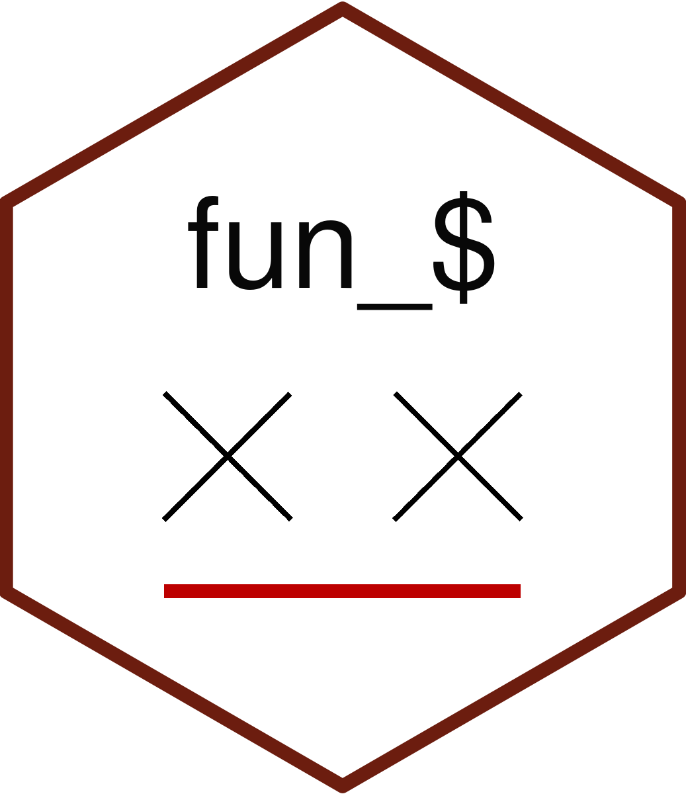

<!-- README.md is generated from README.Rmd. Please edit that file -->

# fun.valuation 

<!-- badges: start -->

<!-- badges: end -->

fun.valuation represents a set of tools aimed to facilitate fundamental
analysis of publicly traded companies. This package contains functions
written to compute all the relevant financial trivia (ROIC, ROE,
Expected growth, value / share etc.).

In order to perform a top-to-bottom analysis with minimum hustle, please
check [fun_pipeline](https://github.com/TracyRage/fun_pipeline).
`fun_pipeline` contains different kinds of pipelines designed for the
analysis of 2-stage / uniform / start-up firms.

Just write the most recent data from SEC fillings and get value of the
firm based on DCF model.
